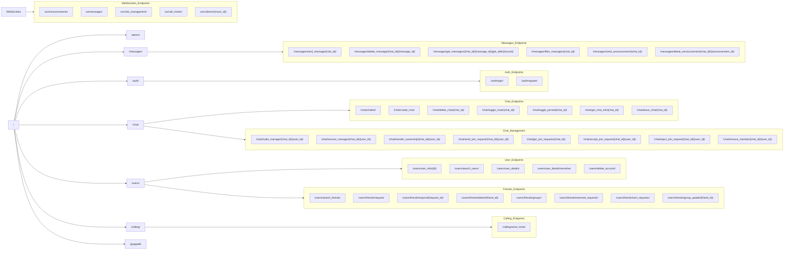

```mermaid
graph LR
    Root["/"]
    Root --> Admin["/admin/"]
    Root --> Messages["/messages/"]
    Root --> Auth["/auth/"]
    Root --> Chat["/chat/"]
    Root --> Users["/users/"]
    Root --> Calling["/calling/"]
    Root --> Grappelli["/grappelli/"]
    
    %% Authentication endpoints
    subgraph Auth_Endpoints
        Login["/auth/login/"]
        Register["/auth/register/"]
    end
    Auth --> Auth_Endpoints
    
    %% Message endpoints
    subgraph Messages_Endpoints
        SendMessage["/messages/send_message/{chat_id}/"]
        DeleteMessage["/messages/delete_message/{chat_id}/{message_id}/"]
        GetMessages["/messages/get_messages/{chat_id}/{message_id}/{get_after}/{count}/"]
        FilterMessages["/messages/filter_messages/{chat_id}/"]
        SendAnnouncement["/messages/send_announcement/{chat_id}/"]
        DeleteAnnouncement["/messages/delete_announcement/{chat_id}/{announcement_id}/"]
    end
    Messages --> Messages_Endpoints
    
    %% Chat endpoints
    subgraph Chat_Endpoints
        ChatList["/chat/chatlist/"]
        CreateChat["/chat/create_chat/"]
        DeleteChat["/chat/delete_chat/{chat_id}/"]
        ToggleMute["/chat/toggle_mute/{chat_id}/"]
        TogglePinned["/chat/toggle_pinned/{chat_id}/"]
        GetChatInfo["/chat/get_chat_info/{chat_id}/"]
        LeaveChat["/chat/leave_chat/{chat_id}/"]
    end
    Chat --> Chat_Endpoints
    
    %% Chat management endpoints
    subgraph Chat_Management
        MakeManager["/chat/make_manager/{chat_id}/{user_id}/"]
        RemoveManager["/chat/remove_manager/{chat_id}/{user_id}/"]
        TransferOwnership["/chat/transfer_ownership/{chat_id}/{user_id}/"]
        SendJoinRequest["/chat/send_join_request/{chat_id}/{user_id}/"]
        GetJoinRequests["/chat/get_join_requests/{chat_id}/"]
        AcceptJoinRequest["/chat/accept_join_request/{chat_id}/{user_id}/"]
        RejectJoinRequest["/chat/reject_join_request/{chat_id}/{user_id}/"]
        RemoveMember["/chat/remove_member/{chat_id}/{user_id}/"]
    end
    Chat --> Chat_Management
    
    %% User endpoints
    subgraph User_Endpoints
        UserInfo["/users/user_info/{id}/"]
        SearchUsers["/users/search_users/"]
        UserDetails["/users/user_details/"]
        UserDetailsSensitive["/users/user_details/sensitive/"]
        DeleteAccount["/users/delete_account/"]
    end
    Users --> User_Endpoints
    
    %% Friends endpoints
    subgraph Friends_Endpoints
        SearchFriends["/users/search_friends/"]
        SendFriendRequest["/users/friends/request/"]
        RespondToFriendRequest["/users/friends/respond/{request_id}/"]
        DeleteFriend["/users/friends/delete/{friend_id}/"]
        FriendGroups["/users/friends/groups/"]
        ReceivedRequests["/users/friends/received_requests/"]
        SentRequests["/users/friends/sent_requests/"]
        UpdateFriendGroup["/users/friends/group_update/{friend_id}/"]
    end
    Users --> Friends_Endpoints
    
    %% Calling endpoints
    subgraph Calling_Endpoints
        SendInvite["/calling/send_invite/"]
    end
    Calling --> Calling_Endpoints
    
    %% WebSocket connections
    subgraph WebSockets_Endpoints
        WSAnnouncements["ws/announcements/"]
        WSMessages["ws/messages/"]
        WSChatManagement["ws/chat_management/"]
        WSCallInvites["ws/call_invites/"]
        WSCallroom["ws/callroom/{room_id}/"]
    end
    WebSockets[WebSockets] --> WebSockets_Endpoints
```