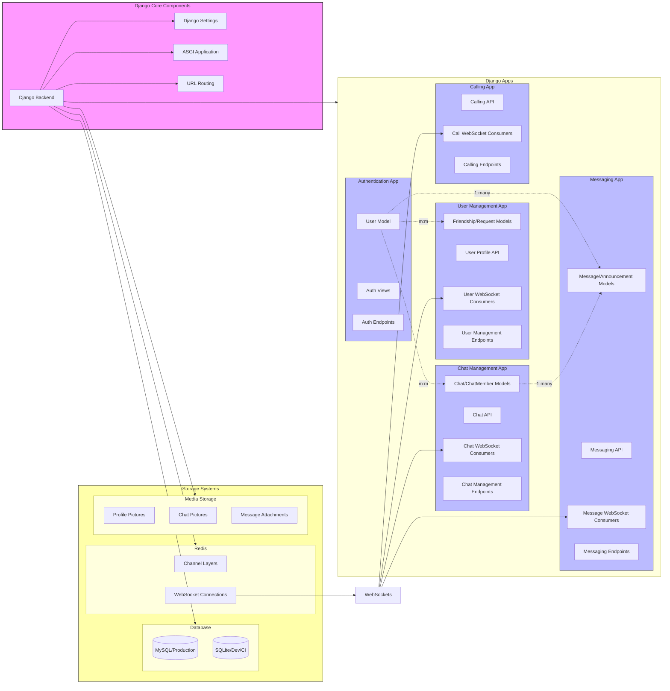

```mermaid
graph LR
    %% Main Django Project with subgraphs for cleaner organization
    subgraph Core["Django Core Components"]
        Django[Django Backend]
        Settings[Django Settings]
        ASGI[ASGI Application]
        URLs[URL Routing]
    end
    
    Django --> Settings
    Django --> ASGI
    Django --> URLs
    
    %% Storage components
    subgraph Storage["Storage Systems"]
        subgraph Database["Database"]
            MySQL[(MySQL/Production)]
            SQLite[(SQLite/Dev/CI)]
        end
        
        subgraph Redis["Redis"]
            ChannelLayers[Channel Layers]
            RedisWS[WebSocket Connections]
        end
        
        subgraph MediaStorage["Media Storage"]
            ProfilePics[Profile Pictures]
            ChatPics[Chat Pictures]
            Attachments[Message Attachments]
        end
    end
    
    Django --> Database
    Django --> Redis
    Django --> MediaStorage
    
    %% Django Apps
    subgraph DjangoApps["Django Apps"]
        %% Authentication App
        subgraph Authentication["Authentication App"]
            AuthModels[User Model]
            AuthViews[Auth Views]
            AuthURLs[Auth Endpoints]
        end
        
        %% User Management App
        subgraph UserManagement["User Management App"]
            UserModels[Friendship/Request Models]
            UserViews[User Profile API]
            UserConsumers[User WebSocket Consumers]
            UserURLs[User Management Endpoints]
        end
        
        %% Chat Management App
        subgraph ChatManagement["Chat Management App"]
            ChatModels[Chat/ChatMember Models]
            ChatViews[Chat API]
            ChatConsumers[Chat WebSocket Consumers]
            ChatURLs[Chat Management Endpoints]
        end
        
        %% Messaging App
        subgraph Messaging["Messaging App"]
            MessageModels[Message/Announcement Models]
            MessageViews[Messaging API]
            MessageConsumers[Message WebSocket Consumers]
            MessageURLs[Messaging Endpoints]
        end
        
        %% Calling App
        subgraph Calling["Calling App"]
            CallViews[Calling API]
            CallConsumers[Call WebSocket Consumers]
            CallURLs[Calling Endpoints]
        end
    end
    
    Django --> DjangoApps
    
    %% WebSocket Connections
    WebSockets[WebSockets] --> UserConsumers
    WebSockets --> ChatConsumers
    WebSockets --> MessageConsumers
    WebSockets --> CallConsumers
    RedisWS --> WebSockets
    
    %% Model Relationships (simplified to reduce diagram width)
    AuthModels -. "1:many" .-> MessageModels
    AuthModels -. "m:m" .-> ChatModels
    ChatModels -. "1:many" .-> MessageModels
    AuthModels -. "m:m" .-> UserModels
    
    %% Styling
    classDef core fill:#f9f,stroke:#333,stroke-width:2px
    classDef app fill:#bbf,stroke:#333,stroke-width:1px
    classDef data fill:#ffa,stroke:#333,stroke-width:1px
    
    class Core core
    class Authentication,UserManagement,ChatManagement,Messaging,Calling app
    class Storage data
``` 